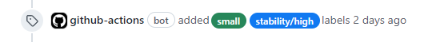

# Pull request size and stability labels

This action adds size and code stability labels to pull requests.



| PR additions | Label       |
| ------------ | ----------- |
| 0-24         | extra small |
| 25-74        | small       |
| 75-149       | medium      |
| 150+         | large       |

Code stability is evaluated for each contributor.

| Stability rating | Percentile | Label            |
| ---------------- | ---------- | ---------------- |
| <1379            | <33rd      | stability/low    |
| 1379-1621        | 33-66th    | stability/medium |
| \>1621           | \>66th     | stability/high   |

When a contributor deletes lines of code, he increases his rating and lowers the rating of the deleted lines author. Elo rating system is used. [More...](https://github.com/victorx64/devrating)

## Usage

Throw this to `.github/workflows/pr-label.yml` in your repo:

```yaml
name: Add PR size and stability labels
"on":
  pull_request:
    types: [opened, synchronize]
  push:
    branches: [master, main]
jobs:
  add-pr-labels:
    permissions:
      contents: read
      pull-requests: write
    runs-on: ubuntu-latest
    steps:
      - uses: victorx64/pr-label@v0
        with:
          # Optional pattern used to limit paths.
          # Example: "'*.js' ':!*.spec.js' .".
          # See https://git-scm.com/docs/gitglossary#Documentation/gitglossary.txt-aiddefpathspecapathspec
          git-pathspec: # optional
```
